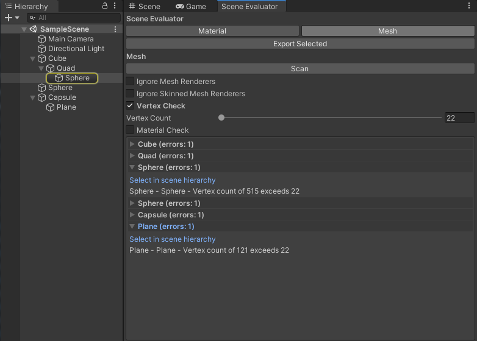
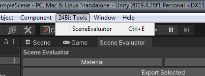

# 24Bit-scene-evaluator

This is a assessment task done for 24Bit Games.



## The Brief

Create a Unity Editor Tool that can find objects in the currently open scene based on user specified filtering criteria.

### Functionality of the tool should be as follows:

- Execute in the Unity Editor only.
- Exist in an Editor panel that can be launched via the Menu bar as well as a
  hotkey.
- Be fully dockable and have hover state tooltips for each criteria.
- Have separate tabs for each category.
- Be configured in a way that it is easy to extend by adding new category tabs and/or filtering criteria.

### Features of the tool required:

- Ability to find all objects in the scene that satisfy any or all of the following filtering criteria:
- Mesh Category:
  - Have more than X vertices.
  - Have more than 1 material.
  - Ignore SkinnedMeshRenderers and/or MeshRenderers
- Material Category:
  - Have a Base Texture with a dimension that is greater than X.
  - Uses a specified Shader.
- Successful searches should be selected in the Scene Hierarchy Inspector Window.
  - Bonus points for displaying the results as a selectable list of objects in the panel of your editor.
- Ability to output a list of selected objects and the value of each criteria to a .CSV (comma separated value) file that can be imported into a spreadsheet editor to view.

## How To

The editor window can be opened with Cntr+E or via the menu bar


### Category

New category tabs can be added by creating a new class with this template
```C#
#if (UNITY_EDITOR)
namespace Tools
{
    public class ExampleCategory : CatagoryTabBase
    {
        // The criteria options are defined here

        public override void Draw()
        {
            base.Draw();

            // Here we draw the GUI for the filter options
        }

        public override void Scan()
        {
            criteriaMatches = new List<ListEntry>();

            foreach (GameObject gameObject in GetGameObjects())
            {
                //Scan logic goes here...
            }
        }
    }
}
#endif
```

### Criteria

Criteria classes are used withing the categories as well as automatically used when doing a CSV export

New Criteria can be added by creating a new class using this template
```C#
#if (UNITY_EDITOR)
namespace Tools {
    public class ExampleCriteria : CriteriaBase
    {
        public override System.Tuple<object, Object> GetValue(GameObject gameObject)
        {
            //Get the value here and return it and the Object
        }

        public override bool Validate(GameObject gameObject, ref List<string> errors)
        {
            //Validate the values from the GetValue call

            return result;
        }
    }
}
#endif
```